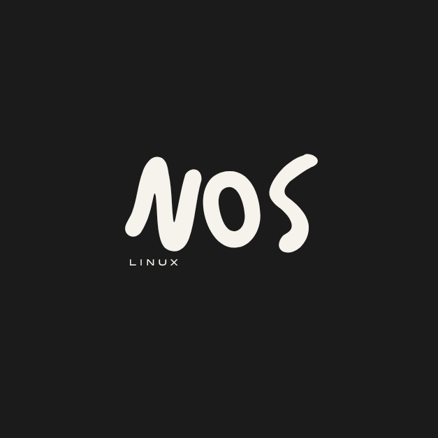

<p align="center">
  
</p>

<h1 align="center">NativOS</h1>

<p align="center">
  A touch-first Linux desktop for rooted ARM64 Android phones.
</p>

NativOS runs Ubuntu and the Phosh/Wayland mobile desktop in a private chroot while Android continues to provide the kernel, drivers, radio, camera stack, and other device-specific hardware support. The display server and Linux root filesystem are bundled in one APK; no separate Termux:X11 application is required.

> [!WARNING]
> NativOS is alpha software. It requires root, can become the Android home launcher, and includes tools that can disable system applications. Back up important data, test it as a normal app before selecting it as the default launcher, and keep another launcher installed.

## Choose the right project

| Your phone | Recommended project |
| --- | --- |
| Rooted ARM64 phone | **NativOS** — Ubuntu chroot, Phosh, embedded X11, Android integration |
| Non-rooted ARM64 phone | [**DroidDesk**](https://github.com/orailnoor/DroidDesk) — a related Linux desktop project designed to work without root |

NativOS does not provide a non-root mode. If you do not want to root your phone, download DroidDesk from its [Releases page](https://github.com/orailnoor/DroidDesk/releases) and follow its README. The projects share some display technology, but their Linux runtime and capabilities are different.

## What to expect

- A full Phosh desktop designed for touch and adaptable to portrait and landscape displays.
- A bundled Ubuntu 24.04 ARM64 root filesystem. First boot extracts about 1 GB of Linux files and can take a minute or more depending on storage speed.
- An embedded X11 server; the external Termux:X11 APK is not required.
- GNOME Console, Files, Software, Calculator, Clocks, and other basic Linux applications.
- Optional Android application shortcuts in the Phosh app drawer.
- A shared folder between Android and Linux.
- A floating menu for Home, Back, Linux overview, keyboard, fullscreen, and settings.
- Turnip/Zink application rendering on compatible Adreno devices when initialization succeeds. Other GPUs fall back to Mesa software rendering.

NativOS is not a replacement ROM. Android still boots and remains underneath Linux. Rooted devices may fail Play Integrity, banking, DRM, or enterprise security checks regardless of NativOS. Android hardware bridges are experimental and should not be treated as replacements for emergency calling or other critical functions.

## Requirements

- ARM64 (`arm64-v8a` / `aarch64`) Android phone
- Android 9 or newer
- Working root through Magisk, KernelSU, APatch, or a compatible `su` implementation
- At least 4 GB RAM; 6 GB or more is recommended for large desktop applications
- At least 4 GB free storage; allow more space for Flatpaks and development tools
- Internet access for installing or updating Linux applications

The current alpha has been exercised on a Samsung Galaxy S23, Pixel 6a, Poco F1, and Moto G71. This is a test matrix, not a guarantee that every vendor ROM or root configuration works.

## Install NativOS

1. Open the [Releases page](https://github.com/orailnoor/NativOS/releases) on the rooted phone.
2. Download the latest ARM64 APK.
3. Allow your browser or file manager to install unknown applications when Android asks.
4. Install and open NativOS.
5. Allow notifications and grant the permanent root request from your root manager.
6. Keep the app open while it prepares the bundled Linux system. Do not force-stop it during first boot.
7. Confirm that the Phosh desktop, touch input, keyboard, rotation, and Android return path work.
8. Only then, if desired, open NativOS Settings and select NativOS as the default Android launcher.

If Android reports a signature conflict while updating an older development build, uninstall that build first. Uninstalling NativOS erases its Linux root filesystem and installed Linux applications, so copy important files to the shared folder before doing this.

## Basic controls

- Tap the floating three-dot button to open the NativOS menu.
- Use **Home** to return to the Linux home screen.
- Use **Back** for the active Linux application.
- Use **Overview** for Linux application switching.
- Use **Keyboard** to show or hide the Android keyboard. A three-finger tap also toggles it.
- Use **Fullscreen** for desktop applications that do not size themselves correctly.
- NativOS Settings can also be opened from the ongoing Android notification.
- The current alpha uses `1234` for the Linux lock-screen PIN. SSH does not accept this password.

## Shared files

Android files placed in:

```text
Internal storage/NativOS
```

appear inside Linux at:

```text
/root/Shared
```

Android's Files app may also show a **NativOS Shared** storage provider. Sync is not instantaneous; keep NativOS running and allow a few seconds for large files. Avoid editing the same file simultaneously from Android and Linux.

## Installing Linux applications

NativOS is ARM64 Linux. An application must provide an `aarch64`/`arm64` build and be compatible with the nested display and Android kernel environment. Being listed on Flathub or offered as a `.deb` does not guarantee ARM64 support.

### Flathub and GNOME Software

GNOME Software uses the per-user Flathub installation. You can also use Console:

```bash
flatpak search APPLICATION_NAME
flatpak install --user flathub APP_ID
flatpak run APP_ID
flatpak update --user
```

Check whether an ARM64 build exists before installing:

```bash
flatpak remote-info --user --arch=aarch64 flathub APP_ID
```

Flatpak applications currently use software rendering for reliability inside the sandbox, even on phones where native Linux applications can use Turnip/Zink. Large Electron, video-editing, emulation, and 3D applications can therefore be slow or may fail to start. x86-64-only Flatpaks cannot run natively.

If a Flatpak download or installation fails:

```bash
flatpak repair --user
flatpak update --user --appstream
flatpak install --user flathub APP_ID
```

If an installed Flatpak does not open, launch it from Console to see the real error:

```bash
flatpak run APP_ID
```

If its icon does not immediately appear in the drawer, wait a few seconds and reopen the drawer. Restart NativOS if the desktop cache still has not refreshed.

Do not blindly add `--no-sandbox`, run random privileged scripts, or copy x86-64 libraries into the root filesystem. Save the terminal output and include it in a bug report instead. When a Flatpak is incompatible, prefer the Ubuntu ARM64 package if one exists.

### Ubuntu packages

Packages from the configured Ubuntu repositories are the most direct option:

```bash
apt update
apt install PACKAGE_NAME
```

These applications run outside Flatpak's sandbox. They generally integrate more predictably, but they have full access to the NativOS Linux environment.

### Local `.deb` files

Place the `.deb` in the Android NativOS shared folder, then verify it in Linux:

```bash
cd /root/Shared
dpkg-deb -f package.deb Package Version Architecture
```

The architecture must be `arm64` or `all`. Install it with `apt`, which can resolve dependencies:

```bash
apt install ./package.deb
```

If an interrupted package operation leaves APT in a broken state:

```bash
dpkg --configure -a
apt --fix-broken install
```

Do not run `apt autoremove` without reviewing its complete removal list; manually installed desktop components may still be marked as automatic dependencies.

### AppImage, Snap, and foreign architectures

- AppImages must be built for ARM64. FUSE-based mounting is not guaranteed on Android kernels.
- Snap is not supported because this chroot does not run a normal systemd-based Ubuntu boot.
- AMD64/x86-64 packages do not run natively. Compatibility layers are outside the supported alpha configuration.

### SSH access

When OpenSSH is installed, NativOS starts it on port `8022` with password login disabled. Add your public key to `/root/.ssh/authorized_keys`, then connect using the phone's LAN address:

```bash
ssh -p 8022 root@PHONE_IP
```

Keep `/root/.ssh` mode `0700` and `authorized_keys` mode `0600`. Do not expose port 8022 directly to the internet.

## GPU and performance

On supported Qualcomm/Adreno phones, NativOS makes the Android KGSL device available to Linux and attempts to use Turnip with Zink for native Linux applications. Phosh itself currently uses Pixman because accelerated compositor presentation through the embedded X11 path is not yet reliable. Flatpaks deliberately use software rendering in this release.

On Tensor/Mali, MediaTek, and devices where a compatible Turnip path is unavailable, NativOS falls back to LLVMpipe/software rendering. This is slower but avoids a hard dependency on one GPU family.

Inspect the renderer from Console:

```bash
glxinfo -B
vulkaninfo --summary
```

An Adreno renderer line does not prove that every application is accelerated; the compositor, native applications, and Flatpaks can use different rendering paths.

## Troubleshooting

### NativOS says root is unavailable

- Open your root manager and grant NativOS permanent access.
- Confirm that `su` works from ADB or another trusted root shell.
- Reopen NativOS after changing the root decision.
- Some root managers require additional namespace or mount settings.

### Black screen or cursor flicker

- Wait for first-boot extraction to finish.
- Confirm that root was granted rather than denied.
- Force-stop NativOS and open it again.
- Disable aggressive battery restrictions for NativOS.
- If it repeats, capture logs instead of repeatedly clearing app data.

### Returning from an Android app shows black

Open the floating menu and use Home. If the surface does not recover, switch away from NativOS and return once, then collect logs. Include whether the problem happens only in portrait, landscape, or after a particular Android application.

### Collecting a useful bug report

From a computer with ADB:

```bash
adb logcat -c
adb logcat | grep -iE 'nativos|xlorie|phoc|phosh|flatpak|bwrap|mesa|vulkan'
```

Include the phone model, Android version, ROM, root manager and version, NativOS release, GPU, exact reproduction steps, screenshot, and terminal output. Remove personal information before posting logs.

Report reproducible problems through [GitHub Issues](https://github.com/orailnoor/NativOS/issues).

## Current limitations

- Alpha quality; not validated on every rooted phone or Android skin.
- ARM64 only.
- Phosh compositor presentation uses Pixman.
- Flatpaks use software rendering and some sandboxed applications do not launch correctly.
- Hardware bridges for calls, SMS, audio, camera, Bluetooth, sensors, and notifications are incomplete or device-dependent.
- No atomic rootfs upgrade or repair UI yet.
- Setting NativOS as the default launcher is optional and recovery should be tested first.
- Root itself can break banking, payment, DRM, and corporate applications.

The detailed engineering checklist is maintained in [PRODUCTION_READINESS.md](PRODUCTION_READINESS.md).

## Building from source

Requirements:

- JDK 17
- Android SDK 35 and build tools
- An ARM64 rootfs prepared with Phosh, Phoc, GNOME Console, required schemas, icons, and NativOS compatibility libraries

The large production rootfs archive is intentionally not stored in Git. Create it using:

```bash
scripts/build-rootfs-asset.sh /path/to/prepared-rootfs \
  android/app/src/main/assets/rootfs/nativos-rootfs-arm64.tgz
```

Then build:

```bash
cd android
./gradlew :app:assembleDebug
```

Official release signing material is private and is never committed. Contributors can build a debug APK or configure their own signing key.

## Security

NativOS executes commands as root to create mounts and run the chroot. Only install APKs from this repository, review system-app removal suggestions carefully, and never share signing keys, root-manager databases, or private logs. NativOS disables selected system packages rather than promising that every package is safe to delete.

## Credits

Created by [orailnoor](https://youtube.com/@orailnoor).

NativOS incorporates modified components from [Termux:X11](https://github.com/termux/termux-x11) and builds on architectural work from [DroidDesk](https://github.com/orailnoor/DroidDesk). It is an independent project and is not affiliated with or endorsed by Termux, GNOME, Ubuntu, Canonical, Flathub, or device manufacturers.

The project is distributed under the [GNU General Public License v3.0](LICENSE). Bundled components retain their respective licenses; see [THIRD_PARTY_NOTICES.md](THIRD_PARTY_NOTICES.md).
